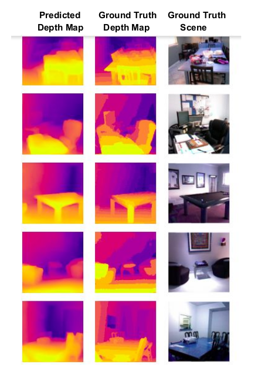

# Monocular Depth Estimation
The goal of this project is to develop a Deep Learning model for Monocular Depth Estimation based on the papers: [U-Net: Convolutional Networks for Biomedical Image Segmentation](https://arxiv.org/abs/1505.04597) and [High Quality Monocular Depth Estimation via Transfer Learning](https://arxiv.org/abs/1812.11941).

> This project implements the UNet Convolutional Neural Network with a ResNet encoder (pre-trained on imagenet weights) on the NYU-Depth v2 dataset and achieved a soft accuracy of 83% on the test set.

The output is demonstrated below where the left image represents the predicted depth map, the middle image represents the ground truth depth map and the right image is the ground truth scene. The color map shown in the output is "Plasma" from Matplotlib color maps. Brighter the color, the nearer the object and darker the color, the farther away is the object.

## Tech used:
- TensorFlow 2.0.0
- Python 3.5.6

## Instructions to run:
- Using `anaconda`:
  - Run `conda create --name <env_name> --file recog.yml`
  - Run `conda activate <env_name>`
- Using `pip`:
  - Run `pip install -r requirements.txt`
- `cd` to `src`
- Run `python main.py`

## Reference:
- @article{Alhashim2018,
  author    = Ibraheem Alhashim and Peter Wonka,
  title     = High Quality Monocular Depth Estimation via Transfer Learning,
  journal   = arXiv e-print,
  volume    = abs/1812.11941,
  year      = 2018,
  url       = https://arxiv.org/abs/1812.11941,
  eid       = arXiv:1812.11941,
  eprint    = 1812.11941
 }

- @inproceedings{fusenet2016accv,
 author    = "Olaf Ronneberger, Philipp Fischer, and Thomas Brox",
 title     = "U-Net: Convolutional Networks for Biomedical Image Segmentation",
 booktitle = "Medical Image Computing and Computer-Assisted Intervention – MICCAI 2015",
 year      = "2015",
 month     = "October",
}
